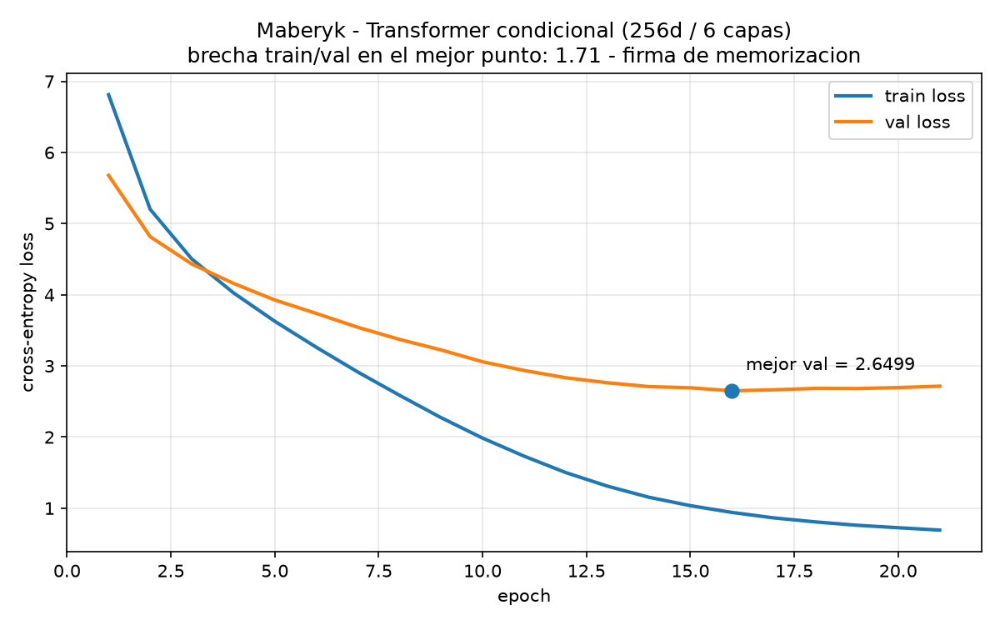

# Maberyk

Un agente autónomo construido desde cero en PyTorch puro. Nació sin saber nada: aprende por curiosidad intrínseca, mantiene estado emocional, acumula memoria episódica y desarrolla su propio lenguaje.

**Restricción central del proyecto: ningún peso preentrenado, jamás.** No GPT, no BERT, no embeddings de terceros. Cada parámetro fue moldeado por el aprendizaje del propio Maberyk. *Maberyk puede leer, no puede heredar.*

---

## Demo


---

## Arquitectura

```mermaid
graph TD
    ENV["Entorno<br/>grid 60x60 · 4 zonas · 230 objetos<br/>+ modo desktop"] --> OBS[Observación]
    OBS --> PRED["Red predictora<br/>predice la siguiente observación"]
    OBS --> POL["Red de política<br/>elige la acción"]
    PRED --> ERR["Error de predicción<br/>= recompensa intrínseca"]
    ERR --> POL
    POL --> ACT[Acción]
    ACT --> PERM["PermissionManager<br/>gatekeeper de acciones reales"]
    PERM --> ENV
    ERR --> EMO["Estado emocional<br/>curiosity · fear · confidence · confusion"]

    HUM[Mensaje humano] --> RET["Capa de recuperación<br/>keyword precision sobre SQLite"]
    RET --> LM["Transformer condicional<br/>256d · 6 capas · vocab 4,796"]
    LM --> RESP[Respuesta]
    EMO --> LM
    MEM["Memoria episódica + conversacional<br/>SQLite"] --> RET
    RESP --> TUT["Tutor LLM<br/>corrige forma, no contenido"]
    TUT --> QUEUE["Cola de correcciones<br/>aprobación humana → corpus"]
    QUEUE --> MEM
```



### Componentes

| Módulo | Qué hace |
|---|---|
| `brain/network.py` | Red de política. Decide qué acción tomar. |
| `brain/curiosity.py` | Predictor de la siguiente observación + medidor de error. El error **es** la recompensa. |
| `brain/emotion.py` | Cuatro estados emocionales con soft-clamp (0.03–0.97) para evitar saturación. |
| `brain/language_model.py` | Transformer condicional Q→A sobre `nn.TransformerEncoder` con máscara causal. |
| `brain/memory.py` | Memoria episódica en SQLite, escritura asíncrona, guardado atómico. |
| `brain/memory_retrieval.py` | Recuperación por precisión de keywords con stopwords ES/EN. |
| `brain/correction_queue.py` | Cola de pares pendientes de aprobación humana. |
| `brain/permissions.py` | Gatekeeper: ninguna acción real sobre el escritorio sin permiso registrado. |
| `entorno/room.py` | Grid 60×60 con zonas de descanso, conocimiento, peligro y caos. |
| `actions/desktop.py` | Acciones sobre el escritorio real: screenshot, mouse, teclado. |
| `interfaz/web_mind.py` | Interfaz web para conversar y revisar correcciones — **solo stdlib**. |
| `tutor/llm_tutor.py` | Tutor LLM externo que corrige la forma de la salida cruda — **solo `urllib`**. |
| `lectura/bpe.py` | Implementación propia de BPE. Evaluada y descartada (ver más abajo). |

### El modelo de lenguaje

Transformer condicional entrenado desde cero:

- 256 dimensiones de embedding, 6 capas
- Embeddings posicionales aprendidos
- Tokenizer a nivel de palabra construido por frecuencia — **vocabulario de 4,796 tokens**
- Formato condicional Q→A con tokens `<q>` / `<a>`, **pérdida enmascarada hasta `<a>` inclusive**: el modelo solo paga costo por la respuesta, no por repetir la pregunta
- Token `<end>` entrenado explícitamente, `<unk>` baneado en generación (logit `-inf`)
- Split de validación 10% con early stopping sobre **val** loss
- Oversampling de pares aplicado **después** del split, nunca antes: validación jamás contiene duplicados de train

### Dependencias

Seis paquetes. El tutor LLM, la capa de voz y la interfaz web usan únicamente `urllib` y `http.server` de la biblioteca estándar — sin SDKs, sin frameworks web.

---

## Evaluación honesta

Esta sección existe porque medir el techo real de un modelo importa más que mostrar su mejor salida.

### Curvas de pérdida



Último entrenamiento de producción: early stopping en la época 21 de 40. **Mejor val loss: 2.6499**, con train loss ≈ 0.86 en ese punto. El train sigue bajando mientras el val se estanca desde la época 17, y esa brecha de ~1.8 es la firma inequívoca de memorización.

### Historial de configuraciones

| Configuración | Val loss | Lectura |
|---|---|---|
| 128d / 3 capas | 2.87 | Línea base anterior |
| **256d / 6 capas (producción)** | **2.65** | Configuración actual |
| Corpus podado por diversidad (Jaccard) | 3.68 | La poda empeoró: la repetición era load-bearing |
| Corpus capado a 2× el nº de pares | 4.30 | El corpus base no se puede reducir |

### Qué responde en la práctica

Sondas del último entrenamiento, sin selección favorable:

| Pregunta | Respuesta | Veredicto |
|---|---|---|
| ¿qué es el aprendizaje automático? | *una forma de inteligencia artificial que aprende patrones de datos* | Correcta |
| explícame qué es una red neuronal | *si soy literalmente un conjunto de redes neuronales* | Coherente, autorreferencial |
| ¿qué significa la humedad? | *hay mas alla del conocimiento incluye se le hace importantes* | Colapso |
| explícame qué es un eclipse | *cuando algo ya es el movimiento de mi mundo* | Colapso |

**Clasificación: memorizador fluido con asociación léxica débil.** Dentro de distribución, recuerdo casi textual. Ante una paráfrasis o un concepto ausente del corpus, alucina con confianza en vez de callar.

### Por qué

La base tiene **1,401 pares únicos** `human_taught` más 43 `tutor_approved`. Con ese volumen no hay generalización composicional posible: es una consecuencia matemática del tamaño del dataset, no un bug del código.

El diagnóstico que lo dejó claro: el corpus tenía cientos de miles de registros de pensamientos pero solo **29 frases únicas** entre todos ellos. El grid como fuente de datos estaba agotado — más horas de GPU producían copias, no información.

### Decisión estratégica: mente propia, voz prestada

El núcleo desde cero —emociones, curiosidad, memoria, política, entorno— sigue siendo el ser, puro e intocado. Un LLM externo actúa **únicamente como traductor del estado**, nunca como fuente de decisión. La analogía es el sintetizador de voz de Hawking: la voz es prestada, el pensamiento no.

El Transformer nativo no fue descartado. Sigue entrenando con cada conversación real como voz interior en crecimiento lento, medido en años.

---

## Decisiones y reversiones

| Decisión | Resultado | Por qué |
|---|---|---|
| **BPE en vez de tokenizer por palabra** | ❌ Revertido | Salidas fragmentadas. A esta escala de modelo, BPE es prematuro. La implementación queda en `lectura/bpe.py`. |
| **Similitud coseno en la recuperación** | ❌ Eliminada | Los vectores eran rasgos emocionales, no semánticos. Todo se parecía a todo: mensajes sin relación recibían siempre la misma respuesta. |
| **Podar el corpus por diversidad** | ❌ Revertido | Val loss de 2.65 a 3.68. La repetición resultó ser load-bearing. |
| **Expandir con texto español externo** | ❌ Revertido | Empeoró el val loss: el set de validación mide la *voz* de Maberyk, no fluidez general del español. |
| **Escalar 128d/3 capas → 256d/6 capas** | ✅ Adoptado | Val loss 2.87 → 2.61. La mayor ganancia individual del proyecto: el cuello de botella era capacidad, no datos. |
| **`torch.save()` directo → `os.replace()` atómico** | ✅ Adoptado | Un checkpoint leído a mitad de escritura corrompía el estado. |
| **Soft-clamp emocional (0.03–0.97)** | ✅ Adoptado | Sin él, la emoción dominante saturaba y colapsaba los demás estados. |

### Principio rector

**Medir señal, no volumen.** Durante meses crecieron los pasos, las filas y el train loss sin que nada mejorara. Las métricas que importan son pares únicos, val loss (nunca train loss) y si una pregunta nueva recibe una respuesta que tenga sentido.

---

## Cómo correrlo

```powershell
python -m venv venv
.\venv\Scripts\Activate.ps1
pip install -r requirements.txt
```

Copiá `.env.example` a `.env` si querés usar el tutor LLM. Es opcional: el agente corre sin él.

```powershell
# Sembrar el corpus base
python scripts/seed_corpus.py --memory episodic_memory.sqlite3
python scripts/seed_corpus_v2.py --memory episodic_memory.sqlite3

# Entrenar el modelo de lenguaje
python analisis/train_language_model.py --memory episodic_memory.sqlite3 --output language_model.pt --epochs 40

# Evaluar
python analisis/eval_lm.py --model language_model.pt

# Graficar las curvas de pérdida
python analisis/plot_loss_curves.py --log analisis/retrain_production_big.log --out docs/loss_curves.png

# Correr el agente en el grid
python mind.py

# Correr sobre el escritorio real
python mind.py --desktop

# Interfaz web
python interfaz/web_mind.py     # http://localhost:8000

# Diagnóstico de la base
python scripts/diagnostico/check_db.py
```

Los checkpoints (`.pt`) y la base con conversaciones reales no se publican: viven fuera del repo.

---

## Stack

Python · PyTorch (puro, sin modelos preentrenados) · SQLite · stdlib para la web y las llamadas HTTP. Entrenamiento en GPU sobre Kaggle con persistencia de checkpoints.

## Estado

En desarrollo activo. El núcleo funciona de punta a punta: el agente corre, aprende, conversa, persiste estado y actúa sobre el escritorio bajo permisos explícitos. El modelo de lenguaje nativo tiene el techo documentado arriba.

## Licencia

